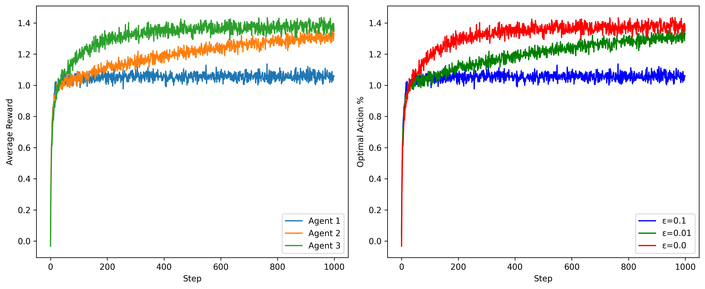

# 🎰 10-Armed Bandit Simulation

This project implements and compares different action-selection strategies in a **multi-armed bandit** environment. It is inspired by the foundational algorithms presented in Sutton & Barto's *Reinforcement Learning: An Introduction*.

---

## 📌 Algorithms Implemented

- **ε-greedy** (with various ε values)
- **Upper Confidence Bound (UCB)**
- **Gradient Bandit Algorithm** (with baseline)

Each agent interacts with a simulated 10-armed bandit where each arm has a different expected reward.

---

## 📊 Results

The following plots summarize performance:

| Average Reward | % Optimal Action Chosen |
|----------------|-------------------------|
|  |  |

📂 Additional `.npy` files with raw results are included for deeper analysis.

---

## ▶️ How to Run

Make sure you have Python 3.8+ installed.

Create a virtual environment (recommended):
```bash
python3 -m venv bandit
source bandit/bin/activate
